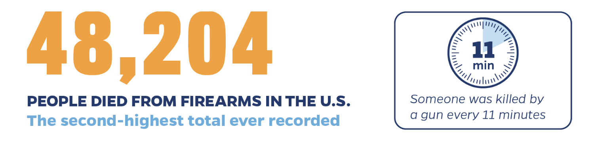
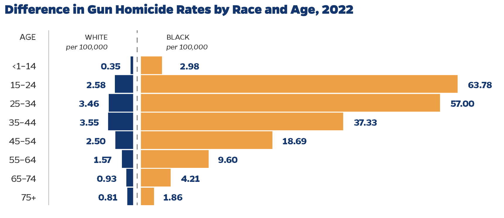
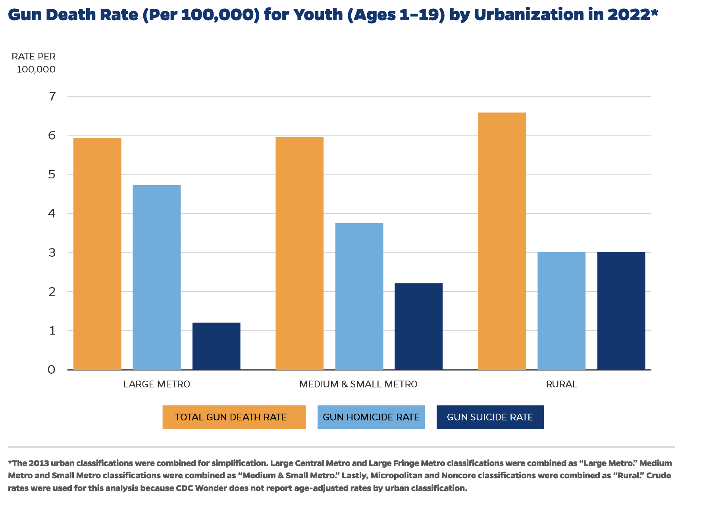

```{r setup, include=FALSE}
knitr::opts_chunk$set(echo = FALSE)
```

Healthy communities thrive when all members experience physical and psychological safety. Gun violence increasingly threatens the health of our communities — particularly for youth and young adults. The greater Charlottesville community has seen an increase in gun violence, threatening the health of individual residents and our communal life. The impacts of gun violence are not confined to those directly involved in violent incidents; the impacts reverberate throughout the community, eroding the collective health of the larger community.

```{r out.width='60%', fig.align='right', out.extra='style="float:right; padding:10px"'}

```

Community gun violence is distinct from other forms of gun violence like accidental shootings, intimate partner violence, identity-based violence, or mass shootings. Community gun violence is commonly understood as interpersonal gun violence that:

-   Is sparked by a dispute between individuals or groups;
-   Occurs outside the home in a public setting;
-   Takes place in communities that have historically been under resourced;
-   And disproportionately impacts young people in Black and Latino communities.[^1]

[^1]: [Community Gun Violence](https://publichealth.jhu.edu/center-for-gun-violence-solutions/in-depth-community-gun-violence). Center for Gun Violence Solutions, Johns Hopkins University. We adopt the language of community gun violence, used by gun violence researchers, to emphasize the impact this form of violence has on the communities in which it occurs.

While gun violencegarners more attention in large urban centers, its presence everywhere is alarming. The incidence of gun violence in Charlottesville and Albemarle County should concern all who live and work in the region. Below we summarize the research on community gun violence - who is impacted, the larger consequences, the root causes - and relate this to what’s happening locally. 

### Who's at Risk?

**Young people**: Nationally, community gun violence is more likely among youth and young adults.[^2] In 2020, gun violence became the leading cause of death among youth (under 19 years old).[^3] According to the Virginia Department of Health’s Office of Vital Records, Virginians aged 18-19 have the highest rate of firearm-related deaths per capita.[^4] This statistic highlights the urgent need to focus on the challenges facing youth and young adults in the Charlottesville region, particularly in communities where socioeconomic conditions perpetuate cycles of violence.

[^2]: Safety Topics: [Guns](https://injuryfacts.nsc.org/home-and-community/safety-topics/guns/data-details/#:~:text=Beginning%20with%20the%2045%2D54,males%20age%2075%20and%20older). National Security Council, Injury Facts. 

[^3]: [Gun Violence: The Impact on Society](https://nihcm.org/publications/gun-violence-the-impact-on-society and https://www.nejm.org/doi/full/10.1056/NEJMc2201761). 2024. The National Institute for Health Care Management, Infographics. 

[^4]: Samantha Toet and Michele Claibourn. 2024. [The State of Gun Violence in the Charlottesville & Albemarle Region](https://virginiaequitycenter.github.io/cville-alb-gun-trauma/data_descriptions). UVA Equity Center.

**Communities of Color**: Nationally, gun homicides disproportionately affect Black, Indigenous, and Latinx individuals.[^5] While young Black males ages 15-34 made up 2% of the U.S. population in 2021 the death of young Black men accounted for 36% of all gun-related homicides.[^6] Among children, Black children were far more likely than children of other races to be the victims of gun violence.[^7]

[^5]: [Impact of Gun Violence on Historically Marginalized Communities](https://everytownresearch.org/issue/impact-of-gun-violence-on-historically-marginalized-communities/). Everytown Research & Public Policy. 

[^6]: [Community Gun Violence](https://publichealth.jhu.edu/center-for-gun-violence-solutions/in-depth-community-gun-violence). Center for Gun Violence Solutions, Johns Hopkins University. 

[^7]: Marc A Zimmerman, Patrick Carter and Rebecca Cunningham. 2019. [Who Gun Violence Affects The Most In America, By The Numbers](https://newsone.com/3884930/gun-violence-victims-statistics/). NewsOne. 

```{r out.width='80%', fig.align='center', fig.cap="Figure Source: JHU[^8]"}

```

[^8]: Silvia Villarreal, Rosie Kim, Elizabeth Wagner, Nandita Somayaji, Ari Davis & Cassandra Crifasi. (2024). [Gun Violence in the United States 2022: Examining the Burden Among Children and Teens.](https://publichealth.jhu.edu/center-for-gun-violence-solutions/research-reports/firearm-violence-in-the-united-states) Johns Hopkins Center for Gun Violence Solutions. Johns Hopkins Bloomberg School of Public Health.

**Residents of Under-resourced Communities**: Gun violence is frequently concentrated in neighborhoods with high rates of poverty, few economic opportunities, and a history of disinvestment.[^9] The risk of gun violence is higher for residents in disadvantaged neighborhoods and those marked by income inequality and residential segregation.[^10] Racially and ethnically minoritized populations are more likely to live in these under-resourced neighborhoods due to a legacy of structural racism – historic divestment, harmful discriminatory policies, unequal access to quality education – where increased gun violence generates another disproportionate burden.[^11] In a national survey, over 45% of Black and Latinx Americans believe gun violence is an issue in their neighborhood, while this sentiment was only shared by 27% of white Americans.[^12]

[^9]: [Community Gun Violence](https://efsgv.org/learn/type-of-gun-violence/community-gun-violence/). 2021. The Education Fund to Stop Gun Violence. 

[^10]: Kimberly Dalve, Emma Gause, Brianna Mills, Anthony S. Floyd, Frederick P. Rivara & Ali Rowhani-Rahbar. 2021.
[Neighborhood disadvantage and firearm injury: does shooting location matter?](https://injepijournal.biomedcentral.com/articles/10.1186/s40621-021-00304-2). Injury Epidemiology 8. 

[^11]: Paula A. Braveman, Elaine Arkin, Dwayne Proctor, Tina Kauh, and Nicole Holm. 2022. [Systemic And Structural Racism: Definitions, Examples, Health Damages, And Approaches To Dismantling](https://www.healthaffairs.org/doi/10.1377/hlthaff.2021.01394). Health Affairs 41.

[^12]: [Gun Violence is a Racial Justice Issue](https://www.bradyunited.org/resources/issues/gun-violence-is-a-racial-justice-issue). Brady. 

### Far-Reaching Consequences

The trauma of community gun violence is both physical – death, injury, incarceration – and psychological – PTSD, fear, stress – with impacts on individuals, families, communities, and economies. Youth, in particular, are deeply affected due to their developmental vulnerability.

**Direct Impacts**: While lost lives are the most severe harm of community gun violence, gun violence also leaves people injured and traumatized. Gunshots may leave individuals with severe physical injuries, resulting in permanent disabilities, chronic pain, and prolonged recovery periods.[^13] These injuries limit educational and career opportunities, trapping victims in cycles of poverty and reducing their quality of life. Beyond the individual, gun violence places emotional and financial burdens on families, friends, and caregivers. The long-term rehabilitation needs of survivors often strain relationships and deplete financial resources.[^14]

[^13]: [Fast Facts: Firearm Injury and Death](https://www.cdc.gov/firearm-violence/data-research/facts-stats/index.html). 2024. Center for Disease Control.

[^14]: [Gun Violence: The Impact on Society](https://nihcm.org/publications/gun-violence-the-impact-on-society and https://www.nejm.org/doi/full/10.1056/NEJMc2201761). 2024. The National Institute for Health Care Management, Infographics.

In addition, survivors often face mental health challenges such as PTSD, anxiety, and depression,[^15] further limiting their educational and economic opportunities and perpetuating poverty and violence.[^16]

[^15]: Rachel Wamser-Nanney, John T. Nanney, Erich Conrad, and Joseph I. Constans. 2019. [Childhood Trauma Exposure and Gun Violence Risk Factors among Victims of Gun Violence](https://www.ncbi.nlm.nih.gov/pmc/articles/PMC7043369/). Psychological Trauma 11.

[^16]: [Hidden scars: how violence harms the mental health of children](https://violenceagainstchildren.un.org/sites/violenceagainstchildren.un.org/files/documents/publications/final_hidden_scars_lhow_violence_harms_the_mental_health_of_children.pdf). 2020. The Office of the Special Representative of the Secretary-General on Violence against Children, UN. 

The trauma of community gun violence extends beyond those who are directly injured to those who are witness to shootings. Constant fear and stress can cause long-term physiological damage, including high blood pressure and weakened immune systems.[^17] Youth are especially vulnerable; exposure to gun violence can disrupt development and lead to behavioral issues, social disengagement, and higher rates of criminal involvement.[^18] Children and adolescents who witness violence are particularly at risk for behavioral problems as they attempt to cope with trauma. 

[^17]: [Gun Violence: Prediction, Prevention, and Policy](https://www.apa.org/pubs/reports/gun-violence-prevention). 2013. American Psychological Association. 

[^18]: [Gun Violence: Prediction, Prevention, and Policy](https://www.apa.org/pubs/reports/gun-violence-prevention). 2013. American Psychological Association.


**Community Impacts**: At the community level, gun violence leads to significant social and economic disruption.[^20] Increased demand for law enforcement, healthcare, and criminal justice services diverts funding from other essential areas like education and mental health. Additionally, rising healthcare costs and long-term care for survivors further burden both the public system and families. The economic costs extend to decreased property values and reduced business activity, weakening local economies.[^21]

[^20]: Andre Gobbo. 2023. [The economic costs of gun violence in the United States](https://equitablegrowth.org/the-economic-costs-of-gun-violence-in-the-united-states/). Washington Center for Equitable Growth. 

[^21]: [The Economic Toll of Gun Violence](https://www.jec.senate.gov/public/_cache/files/69fcc319-b3c9-46ff-b5a6-8666576075fe/the-economic-toll-of-gun-violence-final.pdf). Joint Economic Committee, U.S. Congress.

The psychological trauma caused by gun violence erodes community-level trust and social cohesion, generating what the U.S Surgeon General’s Advisory calls “the collective toll.”[^22] Communities that are affected by frequent gun violence face collective trauma and a pervasive sense of fear and insecurity.[^23] Residents are less likely to participate in public life or use communal spaces, weakening social bonds and further isolating individuals.[^24] This breakdown in trust extends to institutions, as residents may feel disconnected from local governments and authorities, and hesitant to engage with local services.[^25]

[^22]: [Firearm Violence: A Public Health Crisis in America](https://www.hhs.gov/sites/default/files/firearm-violence-advisory.pdf). 2024. The U.S. Surgeon General’s Advisory. 

[^23]: James Garbarino. 2022. [The War-Zone Mentality — Mental Health Effects of Gun Violence in U.S. Children and Adolescents](https://www.nejm.org/doi/pdf/10.1056/NEJMp2209422). The New England Journal of Medicine 387.

[^24]: Stan Korotchenko and Kim M. Anderson. 2020. [Community-Based Participatory Research: How Residents of a Small Low-Income Racially Homogenous Disadvantaged Neighborhood Perceive the Effects of Poverty Stigma, Community Disorder, & Feelings of Unsafety on Health](https://www.qualitativecriminology.com/pub/v8i4p5/release/1). Qualitative Criminology 8. 

[^25]: Rod K. Brunson and Brian A. Wade. 2019. [“Oh hell no, we don’t talk to police”: Insights on the lack of cooperation in police investigations of urban gun violence](https://ccjs.umd.edu/sites/ccjs.umd.edu/files/pubs/Criminology%20%20%20Public%20Policy%20-%202019%20-%20Brunson%20-%20Oh%20hell%20no%20%20we%20don%20t%20talk%20to%20police.pdf). Criminology and Public Policy 18. 

### Factors that Influence Community Gun Violence

**Community Factors**: Economic, racial, and social inequities create and exacerbate the conditions that lead to community gun violence. Areas beset by gun violence are usually facing a variety of challenges around economic hardship: toxic stress, adverse childhood experiences, inadequate and unaffordable housing, underfunded schools, and limited access to health and and social services.[^26], [^27], [^28]

[^26]: Erickson D, Reid C, Nelson L, O'Shaughnessy A, & Berube A. (2008). [The enduring challenge of concentrated poverty in america: Case studies from communities across the US](https://www.brookings.edu/wp-content/uploads/2016/06/1024_concentrated_poverty.pdf). Federal Reserve System; Brookings Institution.

[^27]: Rowhani-Rahbar A, Quistberg DA, Morgan ER, Hajat A, & Rivara FP. (2019). [Income inequality and firearm homicide in the US: a county-level cohort study](https://injuryprevention.bmj.com/content/25/Suppl_1/i25). Injury Prevention

[^28]: Kennedy BP, Kawachi I, Prothrow-Stith D, Lochner K, & Gupta V. (1998). [Social capital, income inequality, and firearm violent crime](https://www.sciencedirect.com/science/article/abs/pii/S0277953698000975). Social Science & Medicine.

This relationship is underscored by evidence that illegal firearm availability and gun homicide are more strongly correlated in communities experiencing socioeconomic disadvantages.[^29] Preliminary research suggests income support could reduce the risk of interpersonal gun violence, further highlighting economic insecurity and income inequality as key causal factors.[^30] The impact of poverty and economic inequities on community violence is no surprise: under-resourced communities have been denied the resources vital to fostering a healthy and safe environment.

[^29]: Semenza DC, Stansfield R, Steidley T, Mancik AM, 2021. [Firearm availability, homicide, and the
context of structural disadvantage](https://journals.sagepub.com/doi/abs/10.1177/10887679211043806). Homicide Studies 10.

[^30]: Ali Rowhani-Rahbara, Julia P. Schleimera, Caitlin A. Moea, Frederick P. Rivaraa, Heather D. Hill. 2022. [Income support policies and firearm violence prevention: A scoping review](https://pubmed.ncbi.nlm.nih.gov/35803348/). Preventative Medicine 165. 

**Individual Factors**: Research points to potential individual-level factors that increase the risk of intersecting with gun violence, though many of these are strongly related to an individual’s community context. In a study of boys aged 16 to 19, both school truancy and witnessing non-gun violence were found to correlate with an individual's likelihood of taking part in gun violence.[^31] A high future orientation may reduce the likelihood of engaging in gun violence, while a sense of hopelessness about the future increases one’s intersection with gun violence.[^32] Across multiple studies, however, the most consistent and powerful individual-level predictor of future violence is a history of violent behavior.[^33]

[^31]: Zachary R. Rowan, Carol A. Schubert, Thomas A. Loughran, Edward P. Mulvey, and Dustin A. Pardini. 2019. [Proximal Predictors of Gun Violence Among Adolescent Males Involved in Crime](https://www.ncbi.nlm.nih.gov/pmc/articles/PMC8860145/). Law and Human Behavior 43. 

[^32]: A.N. Burnside and N.K. Gaylord-Harden, 2019. [Hopelessness and Delinquent Behavior as Predictors of Community Violence Exposure in Ethnic Minority Male Adolescent Offenders](https://link.springer.com/article/10.1007/s10802-018-0484-9). Journal of Abnormal Child Psychology 47. 

[^33]: [Gun Violence: Prediction, Prevention, and Policy](https://www.apa.org/pubs/reports/gun-violence-prevention). 2013. American Psychological Association. 

### The Local Context

**What do we know about community gun violence in the Charlottesville City and Albemarle County region?**

```{r out.width='50%', fig.align='right', out.extra='style="float:right; padding:10px"'}

```

While much of the research on gun violence centers on urban areas, gun violence is all too common in small metropolitan and rural areas, like Charlottesville and Albemarle, as well, as analysis from Johns Hopkins shows.[^8] 

Data from the [Gun Violence Archive](https://virginiaequitycenter.github.io/cville-alb-gun-trauma/data_descriptions#Incidents_of_Gun_Violence), from [police reporting](https://virginiaequitycenter.github.io/cville-alb-gun-trauma/data_descriptions#Police_Reporting), and from VDH reports on firearm injury all point to an increase in gun violence in the Charlottesville-Albemarle region overtime. How do the conclusions from national research – who’s impacted, the larger consequences, and influencing factors – compare to our local context?

**Who’s at Risk**

In  Charlottesville City and Albemarle County, the intersections of age, gender, race, and poverty appear to influence who is disproportionately affected by community gun violence. VDH data on [firearm deaths](https://virginiaequitycenter.github.io/cville-alb-gun-trauma/data_descriptions#Deaths_in_the_Blue_Ridge) in the broader region points to people aged 18-24 as being at the highest risk. Similarly, the number of gun violence incidences as reported by local police jurisdictions are especially high in neighborhoods with [high rates of childhood poverty](https://virginiaequitycenter.github.io/cville-alb-gun-trauma/data_descriptions#Childhood_Poverty). The [Community Safety Working Group Report](https://prescouncil.president.virginia.edu/sites/g/files/jsddwu616/files/2024-01/Final%20Community%20Safety%20Working%20Group%20Report_24.pdf) as well as several local [news](https://www.cvilletomorrow.org/newsletter/our-kids-are-dying-gun-violence-again-spikes-in-charlottesville/) [stories](https://www.c-ville.com/shots-heard-round-the-city) speak to a focus on Black youth and young men as being more frequently and directly impacted by gun violence.

This evidence suggests that the national trends are mirrored here: black male-identifying people under the age of 24 who grew up in neglected and under-resourced regions are most likely to be victims of community gun violence. 

**Consequences**

Harm can result from direct or indirect exposure to gun violence and has long-term negative effects on individual wellbeing along with community cohesion and success; these effects are relevant everywhere. The consequences of community gun violence are deep, impermeable, and generational. The trauma of community gun violence is both physical – death, injury, incarceration – and psychological – PTSD, fear, stress – with impacts on individuals, families, and [our local communities](https://www.29news.com/2024/04/10/neighbors-frustrated-with-gun-violence-after-deadly-shooting-12th-st-rosser-ave/) into the foreseeable future. 

**Influencing Factors**

Past policy choices – residential segregation and [racial covenants](https://mappingcville.com/), [massive resistance](https://jeffersonschoolcitycenterdotorg.wordpress.com/about/history/), the [razing of Black neighborhoods](https://hestia.jmrl.org/findit/Record/1143541), among others – have created under-resourced communities; they do not occur naturally. In Charlottesville, Black residents were disproportionately negatively impacted by [UVAs growth](https://news.virginia.edu/content/uva-and-history-race-property-and-power) as well as by actions of [local governments](https://vinegarhillmagazine.com/vinegar-hill-remembered-eminent-domainurban-removal-and-the-demolition-of-a-peoples-soul/). Communities characterized by disinvestment, with concentrations of residents pushed into economic insecurity, are created by larger policy and systems. Under-resourced communities already confront a lack of economic opportunity. The presence of gun violence adds immeasurably to collective trauma. 

### About This Work 

<div class="shadowbox">
**Fall 2024 Gun Violence Clinic**: Michele Claibourn (Batten Faculty, Equity Center), Kate Hegel, Anastasia Jones-Burdick, Josh LeMay, Owen McCoy, Elizabeth Miles, Frances Summers, Samantha Toet (Equity Center)
</div>

This issue brief is the work of the Fall 2024 Gun Violence Clinic, sponsored by The Batten School of Leadership and Public Policy as part of UVA’s [Gun Violence Solutions Project](https://provost.virginia.edu/subsite/gun-violence-solutions-project/about-gvsp). We are developing a series of issue briefs  intended to identify and distinguish the multiple problems of gun violence to contribute to the community’s work in connecting a range of strategies to the most relevant problems. Recent work has highlighted how distortions in how gun violence is [framed](https://firearmslaw.duke.edu/2020/01/warped-narratives-distortion-in-the-framing-of-gun-policy) or [understood](https://scholarship.richmond.edu/cgi/viewcontent.cgi?article=1549&context=pilr) has limited the policy conversation.

The Gun Violence Clinic is working to support [The Equity Center’s](https://www.virginiaequitycenter.org/) local [data efforts](https://github.com/virginiaequitycenter/cville-alb-gun-trauma) and the [Community Safety Implementation Group’s](https://prescouncil.president.virginia.edu/community-safety) collective work by creating resources for shared community understanding and decision making. As this work progresses, we hope to amplify and share the knowledge of the community. If you believe there is more we should add to this brief or would like to talk to us further, please reach out to Michele Claibourn at mclaibourn\@virginia.edu.  

Future iterations of the Clinic will dive into the research on recommended solutions to community gun violence and how these might be adapted to our context; develop additional issue briefs around other distinct types of gun violence; map the resources, organizations, and programs to reduce gun violence already present within the community; and work with community partners to further expand awareness of the problems of gun violence locally along with solutions. Our work will always be openly shared.

