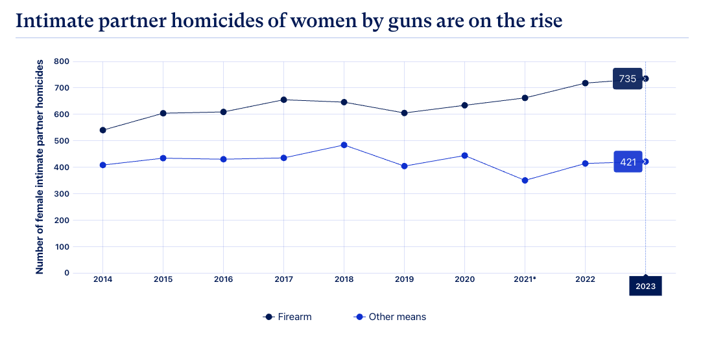
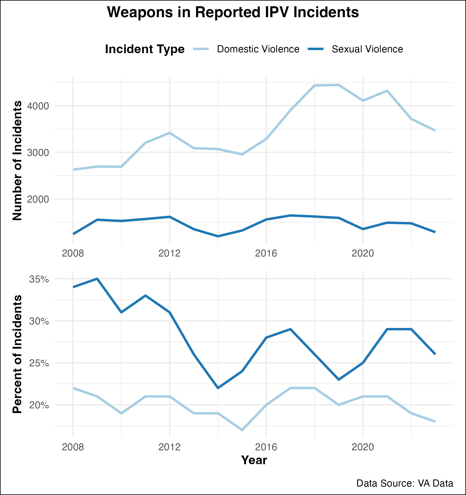

<style>
p.caption {
  font-size: 0.6em;
}
</style>

```{r setup, include=FALSE}
library(knitr)
knitr::opts_chunk$set(echo = FALSE)
```

Intimate Partner Violence (IPV) and gun violence are deeply connected issues in the United States. IPV is defined as physical, sexual, or psychological abuse and intimidation of a person by a current or former partner/spouse, whether or not the partner resides in the home. IPV is a distinct subset of Domestic Violence (DV) which encompasses acts of aggression toward any family member, including child or elder abuse as well as intimate partners.[^1] IPV is widespread, as one-third of women in the United States experience some sort of IPV, and historically marginalized women are disproportionately at risk.[^2] This brief focuses on the intersection of IPV and gun violence in the United States, focusing on incidents of IPV where a firearm is present as well as cases that escalate to homicide.

[^1]: Patra et. al. "Intimate partner violence: Wounds are deeper." Indian Journal of Psychiatry. 2018. <https://pmc.ncbi.nlm.nih.gov/articles/PMC6278226/>.

[^2]: Tobin-Tyler. "Intimate Partner Violence, Firearm Injuries and Homicides: A Health Justice Approach to Two Intersecting Public Health Crises." Journal of Law, Medicine, and Ethics. 2023. <https://pubmed.ncbi.nlm.nih.gov/37226755/>.



<p class="caption">Figure Source: Everytown Research analysis of FBI Supplemental Homicide Report (SHR) data from 2014–2023</p>

The harm caused by IPV is *amplified* by gun violence with the growing use of guns by domestic abusers nationwide. Abusers often use guns to coerce, exert control, threaten, or intimidate victims in situations of IPV. According to a survey by the CDC, almost six million American women report having an interaction with an intimate partner where a gun was used to threaten or harm them.[^3] Having access to a firearm in the home increases the likelihood that a woman will die in a case of IPV homicide by five times.[^4] And when guns are involved in an assault, the likelihood of an assault being fatal increases by twelve.[^5] In short, the ability of an abuser to access a firearm exponentially amplifies the risk of serious injury and Intimate Partner Homicide (IPH), solidifying gun violence as a significant factor to be considered in the broader scope of IPV and IPH.

[^3]: Leemis et. al. "The National Intimate Partner and Sexual Violence Survey: 2016/2017 Report on Intimate Partner Violence." National Center for Injury Prevention and Control (U.S.), Division of Violence Prevention. 2022. <https://stacks.cdc.gov/view/cdc/124646>.

[^4]: Campbell et. al. "Risk Factors for Femicide in Abusive Relationships: Results From a Multisite Case Control Study." American Journal of Public Health. 2002. <https://ajph.aphapublications.org/doi/full/10.2105/AJPH.93.7.1089>.

[^5]: Domestic Violence & Firearms. Giffords Law Center. Accessed 2025. <https://giffords.org/lawcenter/gun-laws/policy-areas/who-can-have-a-gun/domestic-violence-firearms/>.


### Who is Impacted?

Women comprise the majority of victims of IPH, with women 5 times more likely to be murdered by an intimate partner than men.[^6] Men are the majority of perpetrators.[^7] Further, 25% of all female homicide cases in the U.S. are committed by an intimate partner with a firearm,[^8] and among pregnant and postpartum women, homicide is the leading cause of death.[^9]

[^6]: Smith. "Female Murder Victims and Victim-Offender Relationship, 2021." Bureau of Justice Statistics. 2022. <https://bjs.ojp.gov/female-murder-victims-and-victim-offender-relationship-2021>.

[^7]: Rowh A, Jack S. "Notes from the Field: Intimate Partner Homicide Among Women — United States, 2018–2021." Centers for Disease Control. 2024. <https://www.cdc.gov/mmwr/volumes/73/wr/mm7334a4.htm>.

[^8]: Tobin-Tyler. "Intimate Partner Violence, Firearm Injuries and Homicides: A Health Justice Approach to Two Intersecting Public Health Crises." Journal of Law, Medicine, and Ethics. 2023. <https://pubmed.ncbi.nlm.nih.gov/37226755/>.

[^9]: Wallace. "Trends in Pregnancy-Associated Homicide, United States, 2020." American Journal of Public Health. 2022. <https://pmc.ncbi.nlm.nih.gov/articles/PMC9382166/>.

Among women, Indigenous, Black, and Latinx women are at heightened risk of being killed by an intimate partner.[^10] Black women, in particular, are five times more likely to die of IPH during pregnancy and postpartum than their white counterparts.[^11]

[^10]: Tobin-Tyler. "Intimate Partner Violence, Firearm Injuries and Homicides: A Health Justice Approach to Two Intersecting Public Health Crises." Journal of Law, Medicine, and Ethics. 2023. <https://pubmed.ncbi.nlm.nih.gov/37226755/>.

[^11]: Wallace et. al. "Homicide During Pregnancy and the Postpartum Period in the United States, 2018-2019." Journal of Obstetrics & Gynecology. 2021. <https://pubmed.ncbi.nlm.nih.gov/34619735/>.

Gun-involved IPV or IPH can happen at any age and at any stage of a current or previous relationship. In many cases, the use of a gun is the final culmination of a long-term abusive interpersonal relationship. Though guns can be used for threats, intimidation, and even physical harm during the early stages or after the relationship ends. Effective policies must therefore not only aim to prevent IPV but also have reactionary interventions in the case of repeated violence.

### Consequences

Guns increase the lethality of intimate partner violence, and nonfatal incidents have lasting impacts on survivors as well. When guns are used against victims they are often left with lasting physical impairment, psychological terror, and symptoms of PTSD.[^12] Guns can be used in relationships to maintain coercive control, to intimidate, and terrorize.[^13] Women who know of a partner’s use of or access to a gun suffer more severe PTSD symptoms than those who did not endure gun threats.[^14]

[^12]: Report: Guns and Violence Against Women. Everytown Research and Policy. 2025. <https://everytownresearch.org/report/guns-and-violence-against-women/>.

[^13]: Sorenson S, Schut R. "Nonfatal Gun Use in Intimate Partner Violence: A Systematic Review of the Literature." Journal of Trauma, Violence, and Abuse. 2018. <https://pubmed.ncbi.nlm.nih.gov/27630138/>. And Mascia. "No Shots Fired." The Trace. 2018. <https://www.thetrace.org/2018/09/guns-domestic-violence-coercive-control/>.

[^14]: Sullivan T, Weiss N. "Is Firearm Threat in Intimate Relationships Associated with Posttraumatic Stress Disorder Symptoms Among Women?" Mary Ann Liebert Publishers: Violence and Gender. 2017. <https://www.liebertpub.com/doi/10.1089/vio.2016.0024>

Harm extends beyond the immediate victims. Each death generates a cascade of additional trauma for family members and friends. And the threat of physical harm can spread to new partners, children, family members, pets, and bystanders in cases of firearm-related IPV. Collateral Intimate Partner Homicide is when individuals connected to an IPV victim are murdered. One study found that 70% of such victims were killed by a gun, with the primary victim’s new partner at highest risk.[^15]

[^15]: Meyer M, Post L. "Collateral Intimate Partner Homicide." SAGE OPEN. 2013. <https://journals.sagepub.com/doi/10.1177/2158244013484235>.

Abusers’ access to firearms also has significant consequences for public safety, as IPV has been linked to mass shooting events in the U.S. A Bloomberg analysis found that 60% of mass shooting events between 2014 and 2019 were carried out in conjunction with or closely related to domestic violence.[^16] And adolescent IPV has been linked to high-profile school shootings.[^17]

[^16]: Gu. "Deadliest Mass Shootings are Often Preceded by Violence at Home." Bloomberg. 2020. <https://www.bloomberg.com/graphics/2020-mass-shootings-domestic-violence-connection/>.

[^17]: Teen Dating Violence and School Shootings. Teen Dating Violence Month. 2018. <https://www.teendvmonth.org/teen-dating-violence-school-shootings/>.

### Risk Factors

Researchers have repeatedly identified gun ownership as one of the highest risk factors for intimate partner homicide.[^18] This, along with a previous threat with a weapon, the presence of a perpetrator’s child or stepchild in the home, and estrangement are central components of the Danger Assessment Tool used by social work, police, and health professionals.[^19]

[^18]: Campbell et. al. "Risk Factors for Femicide in Abusive Relationships: Results From a Multisite Case Control Study." American Journal of Public Health. 2002. <https://ajph.aphapublications.org/doi/full/10.2105/AJPH.93.7.1089>. And Kivisto et. al. "Firearm Ownership and Domestic Versus Nondomestic Homicide in the U.S." American Journal of Preventative Medicine. 2019. [https://www.ajpmonline.org/article/S0749-3797(19)30197-7/abstract](https://www.ajpmonline.org/article/S0749-3797(19)30197-7/abstract){.uri}. And Messing. "Dr. Jill Messing: Understanding Risk Factors for Intimate Partner Homicide." Everytown Research and Policy. 2024. <https://everytownresearch.org/dr-jill-messing-understanding-risk-factors-for-intimate-partner-homicide/>. And Spencer C, Stith S. "Risk Factors for Male Perpetration and Female Victimization of Intimate Partner Homicide: A Meta-Analysis." Journal of Trauma, Violence, and Abuse. 2020. <https://pubmed.ncbi.nlm.nih.gov/29888652/>.

[^19]: Messing. "Risk-Informed Intervention: Using Intimate Partner Violence Risk Assessment within an Evidence-Based Practice Framework." Journal of Social Work. 2019. <https://academic.oup.com/sw/article-abstract/64/2/103/5308447?redirectedFrom=fulltext&login=false>.

An inability to access resources increases the risk of IPH. Controlling abusers often monitor cell phone usage and internet access, barring victims from using any available resources due to fear of firearm use or threat against themselves or others.[^20] This creates a dilemma for law enforcement and health workers who are working to intervene, as many cases go unreported and they are consequently unable to intervene before IPH occurs.

[^20]: Committee on Health Care for Underserved Women. "Intimate Partner Violence." American College of Obstetricians and Gynecologists. 2022. <https://www.acog.org/clinical/clinical-guidance/committee-opinion/articles/2012/02/intimate-partner-violence>.

Much like Indigenous, Black, and Latinx women are at heightened risk of IPH, they also face additional barriers to help-seeking and accessing resources. Historical discriminatory practices and fears of continued mistreatment by police and child welfare systems, for instance, reduce the prevalence of help-seeking by minoritized women. Language barriers and immigration threats make help-seeking by foreign-born Latina women more challenging.[^21]

[^21]: Survivor Link. "Black, Indigenous, & Latina Women, Intimate Partner Violence, and Police Experiences." Arizona State University Office of Gender-Based Violence. Accessed 2015. <https://socialwork.asu.edu/sites/g/files/litvpz286/files/2022-09/black_indigenous_latina_womens_intimate_partner_violence_and_police_experiences_1_0.pdf>. And Messing et. al. "Preventing Intimate Partner Homicide: The Long Road Ahead." Sage Journal: Homicide Research. 2021. <https://journals.sagepub.com/doi/abs/10.1177/10887679211048492>.

### Local Context

Between 2016 and 2023, there were 3,352 reported incidents of IPV involving a firearm in Virginia. 82% of the victims were female.[^22] In addition, there were 464 incidents of IPH; 60% of homicides were committed with a firearm.[^23] In Charlottesville and Albemarle, there were 33 reported incidents of firearm-related IPV in the same period; 85% of victims were female. Of the nine recorded instances of IPH in the region, eight were committed with a firearm.

[^22]: Toet S, Claibourn M. "The State of Gun Violence in Charlottesville and Albemarle." Center for Community Partnerships at the University of Virginia. 2025. <https://virginiaequitycenter.github.io/cville-alb-gun-trauma/data_descriptions#Intimate_Partner_and_Family_Violence>.

[^23]: Toet S, Claibourn M. "Data: IPV by Type." Center for Community Partnerships at the University of Virginia. 2025. <https://github.com/virginiaequitycenter/cville-alb-gun-trauma/blob/main/data/nibrs_ipv.csv>.

```{r out.width='60%', fig.align='right', out.extra='style="float:right; padding:10px"'}

```

Data from the Virginia Sexual and Domestic Violence Action Alliance ([VAdata](https://vadata.org/)) provides additional insight into the nature of sexual and domestic violence. VAdata collects information from survivors who use the services of sexual and domestic violence member agencies across the state. Individuals may be more likely to seek help from support agencies than to report to the police. VAdata’s 2023 report records that of the 4,944 adults receiving sexual violence advocacy services throughout the state, 26% report the use of a weapon, including a firearm, against them. Similarly, 18% of the 19,249 adults receiving domestic violence services reported use of a weapon or firearm.[^24] 

[^24]: Virginia Sexual and Domestic Violence Action Alliance. "Public Reports." 2023. <https://www.vadata.org/public_reports.html>.

To learn more about the problem of IPV, visit: <https://everytownresearch.org/report/guns-and-violence-against-women/>

```{=html}
<style>
p.comment {
background-color: #d8e6ef;
padding: 10px;
margin-left: 25px;
border-radius: 5px;
}
</style>
```

<p class="comment">If you or someone you know is experiencing domestic violence, please contact the **National Domestic Violence Hotline** by calling 1-800-799-SAFE (7233), texting “START” to 88788, or chatting online at [thehotline.org](thehotline.org). Trained advocates are available 24/7 to provide free confidential support to people anywhere in the US.<br><br> If you are local to the Charlottesville and Albemarle area, the **Sexual Assault Resource Agency (SARA)** offers immediate and low-barrier services and support in multiple languages at <https://www.saracville.org/> along with the **Shelter for Help in Emergency** at <https://www.shelterforhelpinemergency.org/>.</p>

### About This Work

::: shadowbox
**Spring 2025 Gun Violence Clinic**
<br> Content Contributors: Michele Claibourn (Batten Faculty, Center for Community Partnerships), Owen McCoy, Delaney Nystrom, and Carter Purves, and Samantha Toet (Center for Community Partnerships) 
<br> Reviewers: Anastasia Jones-Burdick, Elizabeth Miles, Will Mayer, Jacob Moore,  Kailyn Dickerson, and Riley Wallace
:::

This issue brief is the work of the Spring 2025 Gun Violence Clinic, sponsored by The Batten School of Leadership and Public Policy as part of UVA’s [Gun Violence Solutions Project](https://provost.virginia.edu/subsite/gun-violence-solutions-project/about-gvsp). We are developing a series of issue briefs intended to identify and distinguish the multiple problems of gun violence to contribute to the community’s work in connecting a range of strategies to the most relevant problems. Recent work has highlighted how distortions in how gun violence is [framed](https://firearmslaw.duke.edu/2020/01/warped-narratives-distortion-in-the-framing-of-gun-policy) or [understood](https://scholarship.richmond.edu/cgi/viewcontent.cgi?article=1549&context=pilr) has limited the policy conversation.

The Gun Violence Clinic is working to support [The Center for Community Partnerships](https://communitypartnerships.virginia.edu/)’ local [data efforts](https://github.com/virginiaequitycenter/cville-alb-gun-trauma) and the [Community Safety Implementation Group](https://prescouncil.president.virginia.edu/community-safety)’s collective work by creating resources for shared community understanding and decision making. As this work progresses, we hope to amplify and share the knowledge of the community. If you believe there is more we should add to this brief or would like to talk to us further, please reach out to Michele Claibourn at [mclaibourn\@virginia.edu](mailto:mclaibourn@virginia.edu){.email}.

Future iterations of the Clinic will dive into the research on recommended solutions to unintentional gun violence and how these might be adapted to our context; develop additional issue briefs around other distinct types of gun violence; map the resources, organizations, and programs to reduce gun violence already present within the community; and work with community partners to further expand awareness of the problems of gun violence locally along with solutions. Our work will always be openly shared.
