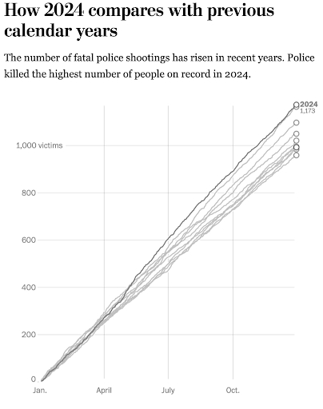
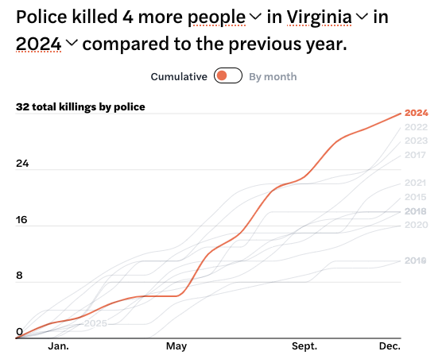

```{r setup, include=FALSE}
knitr::opts_chunk$set(echo = FALSE)
```

Officer-involved shootings refer to incidents where a law enforcement officer discharges a firearm during an encounter with civilians, resulting in injury or fatality. Officer-involved shootings are a subset of use of force incidents.[^1] Reporting requirements for these incidents vary by state. In Virginia, the General Assembly amended the Code of Virginia to require law enforcement agencies to report officer-involved shootings that result in death or serious injury to the Virginia State Police within 48 hours,[^2] reflecting growing concern about excessive use of force by police and the need for greater accountability. Virginia’s policy mandates reports to include details such as the location, circumstances, and identities of those involved.[^3]

[^1]: While there is no universally agreed-upon definition of use of force, law enforcement officers generally receive guidance from their agencies, such as “When an officer uses physical action (beyond simple control), a chemical, or an object to overcome another person’s resistance.” From Prince William County Police Department Manual of General Orders, Use of Force: General Guidelines. Published 6/8/2021. <https://www.pwcva.gov/assets/2021-06/27.01%20General%20Guidelines%20Use%20of%20Force.pdf>.

[^2]: Code of Virginia. § 52-28.2. Reporting of officer-involved shootings; inclusion in annual Crime in Virginia report. 2016. <https://law.lis.virginia.gov/vacode/title52/chapter6/section52-28.2/>.

[^3]: An [analysis of the Virginia data by the Virginia Mercury in 2020](https://virginiamercury.com/2020/06/15/almost-all-major-police-shootings-in-virginia-since-2016-were-ruled-justified-but-states-data-has-big-gaps/) notes that all but one officer-involved shooting reported up to that time had been ruled justified. That report also highlighted the high rate of non-reported incidents, suggesting inadequacies in the available data.

[^4]: The Washington Post. Police Shootings Database: 2015-2024. Last updated January 1, 2025. <https://www.washingtonpost.com/graphics/investigations/police-shootings-database/>.

[^5]: The Washington Post. Police Shootings Database: 2015-2024. Last updated January 1, 2025. <https://www.washingtonpost.com/graphics/investigations/police-shootings-database/>.

```{r out.width='50%', fig.align='right', out.extra='style="float:right; padding:10px"'}

```

The scale of officer-involved shootings is unclear, as data on these events is not systematically captured. From 2015-2024 the Washington Post maintained a database of police shooting incidents after determining that no government agency keeps reliable data.[^6] In 2019, the FBI initiated the National Use-of- Force Data Collection, though participation in the effort is voluntary.[^7] Nevertheless, a national survey estimates there are over 3,500 officer-involved shootings annually in the U.S.[^8] Review of incidents captured by media reports reveals those killed in officer-involved shootings has steadily increased since 2017,[^9] rising to 1,173 incidents in 2024.[^10] While officers face situations that justify the lawful use of, potentially lethal, force, the growing number of injuries and lives lost raises urgent concerns. Recent polling found that 61% of Americans lack confidence that law enforcement officers are adequately trained to prevent excessive force.[^11] Many officer-involved injuries and fatalities represent preventable losses, and the increasing rate raises concern at both the individual and institutional levels.

[^6]: The Washington Post. Police Shootings Database: 2015-2024. Last updated January 1, 2025. <https://www.washingtonpost.com/graphics/investigations/police-shootings-database/>.

[^7]: Federal Bureau of Investigation. National Use-of-Force Data Collection. Accessed February 7, 2025. <https://www.fbi.gov/how-we-can-help-you/more-fbi-services-and-information/ucr/use-of-force>.

[^8]: Bruce Taylor, Weiwei Liu, and Y. Michael Yang. National Survey of Force Used During Police Encounters. NORC at the University of Chicago. Accessed February 7, 2025. <https://www.norc.org/research/projects/a-national-survey-of-police-officer-involved-firearm-shootings.html>.

[^9]: Julie A. Ward, Javier Cepeda, Dylan B. Jackson, Odis Johnson Jr, Daniel W. Webster, and Cassandra K. Crifasi. Study of Fatal and Nonfatal Shootings by Police Reveals Racial Disparities, Dispatch Risks. Johns Hopkins Bloomberg School of Public Health. Published March 13, 2024. <https://publichealth.jhu.edu/2024/study-of-fatal-and-nonfatal-shootings-by-police-reveals-racial-disparities-dispatch-risks>.

[^10]: The Washington Post. Police Shootings Database: 2015-2024. Last updated January 1, 2025. <https://www.washingtonpost.com/graphics/investigations/police-shootings-database/>.

[^11]: Gary Langer. Confidence in police practices drops to a new low: POLL. abc News. Published February 3, 2023. <https://abcnews.go.com/Politics/confidence-police-practices-drops-new-low-poll/story?id=96858308>.

### Who is Impacted?

Officer-involved shootings disproportionately harm members of minority communities, men, and young adults.

Black and Hispanic communities endure a disproportionate share of police use of force incidents. Black Americans, which comprise only about 14% of the national population, are more than twice as likely, compared to white counterparts, to be shot by police.[^12] Results from the Police-Public Contact Survey, part of the National Crime Victimization Survey, suggest that Black and Hispanic residents were twice as likely as white residents to experience the threat of physical force in police-initiated contacts (5.2% and 5.1% compared to 2.4%).[^13]

[^12]: Hossein Zare, Andrea N. Ponce, Rebecca Valek, Michelle Spencer, Cassandra Crifasi, and Darrell Gaskin. Analyzing Fatal Police Shootings: The Roles of Social Vulnerability, Race, and Place in the U.S. American Journal of Preventative Medicine. Published January 2025. [https://www.ajpmonline.org/article/S0749-3797(24)00302-7/fulltext](https://www.ajpmonline.org/article/S0749-3797(24)00302-7/fulltext){.uri}.

[^13]: Elizabeth Davis, Anthony Whyde, and Lynn Langton. Special Report: Contacts Between Police and the Public, 2015. U.S. Department of Justice, Office of Justice Programs, Bureau of Justice Statistics. Published October 2018. <https://bjs.ojp.gov/content/pub/pdf/cpp15.pdf>.

Gender imbalances are also significant. Over 95% of victims in officer-involved shootings are male. Men are not only more likely to be approached by officers (12%) compared to women (9%), but they also face a higher likelihood (4.4%) of experiencing the threat or use of physical force than females (1.8%).[^14] Age also plays a crucial role. Young adults, those 20-39 years of age, face the highest frequency of officer shootings.[^15]

[^14]: Erika Harrell and Elizabeth Davis. Contacts Between Police and the Public, 2018 – Statistical Tables. U.S. Department of Justice, Office of Justice Programs, Bureau of Justice Statistics. Published December, 2020 and revised February 2023. <https://bjs.ojp.gov/content/pub/pdf/cbpp18st.pdf>.

[^15]: Frank Edwards, Hedwig Lee, and Michael Esposito. Risk of being killed by police use of force in the United States by age, race-ethnicity, and sex. Proceedings of the National Academy of Sciences. Published August, 2019. <https://pubmed.ncbi.nlm.nih.gov/31383756/>.

The disproportionate impact of officer-involved shootings on Black and Hispanic communities, young adults, men, and individuals of low socioeconomic status underscores the systemic inequities embedded in modern policing practices.[^16] Many of these disparities are linked to historical legacies, structural biases, and discretionary enforcement practices that continue to shape law enforcement interactions.[^17]

[^16]: Hossein Zare, Nicholas S. Meyerson, Paul Delgado, Cassandra Crifasi, Michelle Spencer, Darrell Gaskin, and Roland J. Thorpe Jr. How place and race drive the numbers of fatal police shootings in the US: 2015–2020. Journal of Preventative Medicine. Published August, 2022. <https://www.sciencedirect.com/science/article/pii/S0091743522001815>.

[^17]: The history of policing in the United States plays a crucial role in understanding officer-involved shootings today. Policing in America has its roots in early slave patrols and post-Civil War law enforcement practices that disproportionately targeted marginalized communities. Over time, policing has evolved into a more professionalized institution with increases to formalized training and structures for oversight, but systemic issues remain, particularly regarding racial disparities, excessive force, and community trust. See <https://www.smithsonianmag.com/smithsonian-institution/long-painful-history-police-brutality-in-the-us-180964098/>.

### Enduring Consequences

Officer-involved shootings impact those directly involved, including the officers, as well as the larger community.

**Impacts on Victims and Communities**

Officer-involved shootings result in devastating consequences for victims, their loved ones, and the communities they belong to. Survivors often suffer life-altering injuries, long-term trauma, and financial instability due to lost wages, medical costs, or funeral expenses. Families of those killed in police encounters endure profound grief, exacerbated by the struggle with navigating opaque legal systems, seeking justice, and overcoming barriers to accountability.

More broadly, affected communities, especially Black and Brown communities, experience deepening distrust of law enforcement.[^18] While the killing of George Floyd in 2020 sparked national and global protests, every incident of an officer-involved shooting has the potential to highlight systemic racial disparities in policing and reinforcing the collective trauma felt by many marginalized groups.[^19] A 2022 survey found that about half of surveyed Black people would prefer to be robbed or burglarized than to have unsolicited contact with police.[^20]

[^18]: Desmond Ang, Panka Bencsik, Jesse Bruhn, and Ellora Derenoncourt. Police violence reduces civilian cooperation and engagement with law enforcement. Harvard Kennedy School, John F. Kennedy School of Government. Published September 20, 2021. <https://scholar.harvard.edu/files/ang/files/abbd_crimereporting.pdf>.

[^19]: Jonathan Ben-Menachem and Gerard Torrats-Espinosa. Police violence reduces trust in the police among Black residents. PLOS ONE. Published September 11, 2024. <https://journals.plos.org/plosone/article?id=10.1371/journal.pone.0308487>.

[^20]: Justin T. Pickett, Amanda Graham, and Francis T. Cullen. The American racial divide in fear of the police. Journal of Criminology. Published January, 2022. <https://onlinelibrary.wiley.com/doi/10.1111/1745-9125.12298>.

Fear of police encounters reduces public cooperation with police, making crime prevention and public safety efforts more difficult. The erosion of trust in law enforcement after an incidence of police violence harms service provision and community safety.[^21] Research has documented a significant decrease in 911 calls after police-involved shootings,[^22] especially in communities of color.[^23]

[^21]: Jonathan Ben-Menachem and Gerard Torrats-Espinosa. Police violence reduces trust in the police among Black residents. PLOS ONE. Published September 11, 2024. <https://journals.plos.org/plosone/article?id=10.1371/journal.pone.0308487>.

[^22]: Maya Mikdash and Reem Zaiour. The impact of police shootings on gun violence and civilian cooperation. Journal of Public Economics. Published September, 2024. <https://www.sciencedirect.com/science/article/pii/S0047272724001257>.

[^23]: Kevin J. Strom and Sean E. Wire. The impact of police violence on communities: Unpacking how fatal use of force influences resident calls to 911 and police activity. RTI International. Published January 24, 2024. <https://www.rti.org/rti-press-publication/impact-police-violence-communities-unpacking-fatal-use-force-influences-resident-calls-911-police-ac>.

**Impacts on Involved Officers and Policing Institutions**

For officers involved in shootings, the personal consequences can be profound. Officers who discharge their weapons in policing encounters may experience post traumatic stress disorder and other psychological responses that diminish overall well-being.[^24] This cumulative stress may result in chronic health issues, poor job performance, and challenges in maintaining a healthy work-life balance.[^25]

[^24]: Benny Solis. The Psychological Effect on Law Enforcement Officers involved in Deadly Police-Involved Shootings. Florida Department of Law Enforcement. Retrieved February 7, 2025. <https://www.fdle.state.fl.us/FCJEI/Programs/SLP/Documents/Full-Text/Solis,-Benny-paper.aspx>.

[^25]: Laurence Miller. Officer-Involved Shooting: Reaction Patterns, Response Protocols, and Psychological Intervention Strategies. International Journal of Emergency Mental Health. Published 2006. <https://ovc.ojp.gov/sites/g/files/xyckuh226/files/media/document/imp_officer_involved_shooting-508.pdf>.

In addition to declining trust, police departments may face increased political scrutiny and operational challenges in response to officer-involved shooting incidents, requiring capacity to be redirected.[^26] Officer-involved shootings frequently become flashpoints for national and local political discourse, including calls for institutional change.

[^26]: International Association of Chiefs of Police. 2016. Officer-Involved Shootings: A Guide for Law Enforcement Leaders. Washington, DC: Office of Community Oriented Policing Services. Published 2016. <https://portal.cops.usdoj.gov/resourcecenter/content.ashx/cops-p350-pub.pdf>.

### What Do We Know About Officer-Involved Shootings?

The absence of consistent and complete data on OIS has limited research into the underlying causes of the increase in police shooting incidents.[^27] Researchers have long lamented the inability to analyze when and why officer-involved shootings occur or to systematically evaluate potential interventions,[^28] and efforts to compile data both inside and outside of government channels has been incomplete.[^29]

[^27]: Howard E. Williams, Scott W. Bowman, and Jordan Taylor Jung. The Limitations of Government Databases for Analyzing Fatal Officer-Involved Shootings in the United States. Criminal Justice Policy Review. Published May 28, 2016. <https://journals.sagepub.com/doi/abs/10.1177/0887403416650927?casa_token=n5nwwIlu8DgAAAAA%3A3orxFPm8VXCnn3nJxHtpV0vx8bocQ5jwm44AecvZOHBIYPcNATLtSmhxMV6_LCijix_TwOEJX12NTg>.

[^28]: David Klinger, Richard Rosenfeld, Daniel Isom, and Michael Deckard. Race, Crime, and the Micro-Ecology of Deadly Force. Criminology and Public Policy. Published November 2015. <https://onlinelibrary.wiley.com/doi/abs/10.1111/1745-9133.12174>.

[^29]: Howard E. Williams, Scott W. Bowman, and Jordan Taylor Jung. The Limitations of Government Databases for Analyzing Fatal Officer-Involved Shootings in the United States. Criminal Justice Policy Review. Published May 28, 2016. <https://journals.sagepub.com/doi/abs/10.1177/0887403416650927?casa_token=n5nwwIlu8DgAAAAA%3A3orxFPm8VXCnn3nJxHtpV0vx8bocQ5jwm44AecvZOHBIYPcNATLtSmhxMV6_LCijix_TwOEJX12NTg>.

Not only is the true scope of these occurrences unknown, the lack of transparency undermines public confidence in police accountability. Without clear, standardized reporting practices, public skepticism intensifies, and law enforcement is left with diminished incentives to adopt or enforce comprehensive use-of-force policies. Legal doctrines such as qualified immunity and limited civil liability further complicate accountability. Although these protections are intended to shield officers from constant litigation, they also reduce the pressure on law enforcement to ensure transparent practices and adopt reforms.

Accountability measures, such as independent oversight boards and transparent disciplinary processes, play a critical role in deterring misconduct. Internal investigations are often inaccessible to the public, and disciplinary actions are often undisclosed.[^30] As there seems to be little recourse when abuses occur, community mistrust builds from low-information. While these procedures support institutions’ autonomy and officers’ privacy, the low availability of information largely removes civilians from effectively engaging in this process.

[^30]: Kempe Ronald Hope Sr. Civilian Oversight for Democratic Policing and its Challenges: Overcoming Obstacles for Improved Police Accountability. Journal of Applied Security Research. Published July 10, 2020. <https://www.tandfonline.com/doi/full/10.1080/19361610.2020.1777807>.

### Our Local Context

```{r out.width='60%',out.extra='style="float:right; padding:10px"'}

```

The [Mapping Police Violence](https://mappingpoliceviolence.org/) project shows that the national increase in individuals killed by law enforcement is also evident in Virginia. However, officer-involved shootings are not always fatal. According to [data](https://virginiaequitycenter.github.io/cville-alb-gun-trauma/data_descriptions#Use_of_Force__Officer-Involved_Shootings) from the Gun Violence Archive, in Charlottesville and Albemarle there were 10 victims of officer-involved shootings between 2016 and 2023. All of the officers reported that the victim was a male armed with a firearm and 4 of the incidents resulted in death of the victim. Half of of these victims were identified as Black, and the median age was 37 years old.[^31]

[^31]: Samantha Toet and Michele Claibourn. The State of Gun Violence in Charlottesville and Albemarle. UVA Gun Violence Solutions Project. Accessed February 7, 2025. <https://virginiaequitycenter.github.io/cville-alb-gun-trauma/data_descriptions#Use_of_Force__Officer-Involved_Shootings>.

### About This Work

::: shadowbox
**Spring 2025 Gun Violence Clinic**<br> Content Contributors: Michele Claibourn (Batten Faculty, Center for Community Partnerships), Anastasia Jones-Burdick, Elizabeth Miles, Samantha Toet (Center for Community Partnerships) <br> Reviewers: Kailyn Dickerson, Will Mayer, Owen McCoy, Jacob Moore, Delaney Nystrom, Carter Purves, Riley Wallace
:::

This issue brief is the work of the Spring 2025 Gun Violence Clinic, sponsored by The Batten School of Leadership and Public Policy as part of UVA’s [Gun Violence Solutions Project](https://provost.virginia.edu/subsite/gun-violence-solutions-project/about-gvsp). We are developing a series of issue briefs intended to identify and distinguish the multiple problems of gun violence to contribute to the community’s work in connecting a range of strategies to the most relevant problems. Recent work has highlighted how distortions in how gun violence is [framed](https://firearmslaw.duke.edu/2020/01/warped-narratives-distortion-in-the-framing-of-gun-policy) or [understood](https://scholarship.richmond.edu/cgi/viewcontent.cgi?article=1549&context=pilr) has limited the policy conversation.

The Gun Violence Clinic is working to support [The Center for Community Partnerships](https://communitypartnerships.virginia.edu/)’ local [data efforts](https://github.com/virginiaequitycenter/cville-alb-gun-trauma) and the [Community Safety Implementation Group](https://prescouncil.president.virginia.edu/community-safety)’s collective work by creating resources for shared community understanding and decision making. As this work progresses, we hope to amplify and share the knowledge of the community. If you believe there is more we should add to this brief or would like to talk to us further, please reach out to Michele Claibourn at [mclaibourn\@virginia.edu](mailto:mclaibourn@virginia.edu){.email}.

Future iterations of the Clinic will dive into the research on recommended solutions to unintentional gun violence and how these might be adapted to our context; develop additional issue briefs around other distinct types of gun violence; map the resources, organizations, and programs to reduce gun violence already present within the community; and work with community partners to further expand awareness of the problems of gun violence locally along with solutions. Our work will always be openly shared.
