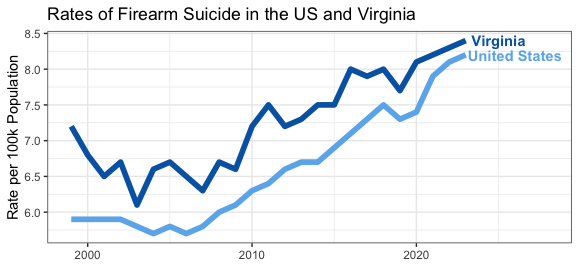
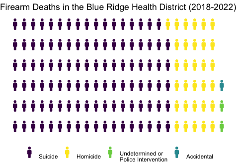

```{r setup, include=FALSE}
knitr::opts_chunk$set(echo = FALSE)
```

```{=html}
<style>
p.comment {
background-color: #d8e6ef;
padding: 10px;
margin-left: 25px;
border-radius: 5px;
}
</style>
```

<p class="comment">*If you need to talk, the 988 Lifeline is here. Call or text 988 or visit [988lifeline.org](https://988lifeline.org/) to speak to someone that cares. You can also visit [Help Happens Here](https://helphappenshere.org/) to get connected to free and low-barrier services.*</p>

```{r out.width='60%', fig.align='right', out.extra='style="float:right; padding:10px"'}

```

Each year, nearly 26,000 Americans end their lives by firearm suicide.[^1] Over the past two decades, firearm suicide rates have increased by 39%.[^2] Firearm suicide consistently outpaces firearm homicides in the U.S., making it a leading cause of gun-related deaths and underscoring its public health significance.[^3] And firearm suicide is distinctly lethal: among all suicide attempts in the United States, firearms are used in only 5 percent but account for over half of suicide deaths.[^4] The high lethality of firearm suicide also distinguishes it from many other forms of gun violence, like unintentional shootings or identity-based violence: 90 percent of all suicide attempts involving a firearm are fatal.[^5] Among patients presenting to the hospital for intentional self-harm, only one in 25 will commit suicide in the next five years.[^6] When connected to resources and treatment, the overwhelming majority of suicide survivors recover. Firearms, and their lethality, leave little to no chance for intervention. A moment of crisis can generate a permanent loss. The framing of firearm suicide often focuses on mental health; however, it can also be viewed through the lens of accessibility to lethal means. 

[^1]: Firearm Suicide in the United States - Fact Sheet. Everytown Research & Policy. Published August 30, 2019 and last updated November 8, 2024. 
<https://everytownresearch.org/report/firearm-suicide/>.

[^2]: Center for Disease Control. WONDER Database. Underlying Cause of Death: 1999-2020 and 2018-2023. Accessed January 2025. <https://wonder.cdc.gov/deaths-by-underlying-cause.html>.

[^3]: Nearly six out of every 10 gun deaths in the US are suicides. Everytown Research analysis of CDC, Provisional Mortality Statistics, Multiple Cause of Death, 2019–2023. Last updated November 8, 2024. <https://everytownresearch.org/stat/six-out-of-every-10-gun-deaths-in-the-us-are-suicides/>.

[^4]: The Truth About Suicide and Guns. Brady United Research. Last updated 2021. <https://www.bradyunited.org/resources/research/the-truth-about-suicide-and-guns>.

[^5]: Andrew Conner, Deborah Azrael, and Matthew Miller. Suicide Case-Fatality Rates in the United States, 2007 to 2014: A Nationwide Population-Based Study. Annals of Internal Medicine. Published December, 2019. <https://pubmed.ncbi.nlm.nih.gov/31791066/>.

[^6]: Robert Carroll, Chris Metcalfe, and David Gunnell. Hospital Presenting Self-Harm and Risk of Fatal and Non-Fatal Repetition: Systematic Review and Meta-Analysis. PLOS One. Published February 28, 2014. <https://journals.plos.org/plosone/article?id=10.1371/journal.pone.0089944>.

### Who is Impacted? 

Eighty-seven percent of firearm suicide victims are men. For men, the risk increases with age, with especially high rates among men aged 55 and older.[^7] The suicide rate among Veterans is significantly high and increasing -- nearly 75 percent of veteran suicides involved guns.[^8]

[^7]: Firearm Suicide in the United States - Fact Sheet. Everytown Research & Policy. Published August 30, 2019 and last updated November 8, 2024. 
<https://everytownresearch.org/report/firearm-suicide/>.

[^8]: Those Who Serve: Addressing Firearm Suicide Among Military Veterans. Everytown Research and Policy. Published February 24, 2025. <https://everytownresearch.org/report/those-who-serve/>.

Suicide rates vary by race and ethnicity, with American Indian and Alaskan Native men experiencing the highest rates (42.6 deaths per 100,000 population), followed by white men (28 deaths per 100,000 population) and Native Hawaiian and Pacific Islander men (19.5 deaths per 100,000 population).[^9]

[^9]: Suicide Prevention: Health Disparities in Suicide. Centers for Disease Control.  Published January 30, 2025. <https://www.cdc.gov/suicide/disparities/index.html>. 

While the firearm suicide rate among young people ages 10 to 24 is lower than for older cohorts, it is increasing. Gun suicide rates are the highest for American Indian and Alaskan Natives, white, and Black youth; and the rates have increased the fastest among Black, Latinx, and Asian and Pacific Islander youth.[^10] Among younger populations (ages 10-24), as well, about 90 percent of firearm suicides are committed by males.

[^10]: The Rise of Firearm Suicide Among Young Americans. Everytown Research and Policy. Published June 2, 2022.  <https://everytownresearch.org/report/the-rise-of-firearm-suicide-among-young-americans/>.

LGBTQ+ youth also have increased vulnerability. Research undertaken by the [Trevor Project](https://www.thetrevorproject.org/) in 2024 reported that 39 percent of all LGBTQ+ young people seriously considered attempting suicide in the past year. Those who reported the presence of a firearm in their home were more more likely (at 43%) to have considered suicide compared to those with no access to a firearm (37%).[^11]

[^11]: Suicide Risk Among LGBTQ+ Young People, by Firearm Access. Everytown Research and Policy. Accessed February 2025.  <https://everytownresearch.org/graph/suicide-risk-among-lgbtq-young-people-by-firearm-access/>.

Suicide rates in rural areas have long been higher than those in urban areas, and the rural-urban difference has widened over time. Among men, firearms were the most frequent method of death by suicide in both urban and rural regions; in 2018, the firearm-related suicide rate for men in rural areas was 18.1 (deaths per 100,000 population) and in urban areas it was 11.5.[^12] 

[^12]: Kristen Pettrone and Sally C Curtin. Urban-rural Differences in Suicide Rates, by Sex and Three Leading Methods: United States, 2000-2018. NCHS Data Brief. Published Aug, 2020. <https://pubmed.ncbi.nlm.nih.gov/33054927/>.

Having access to a firearm increases one’s chance of dying by suicide threefold, meaning that those who own or have access to a gun are especially at risk.[^13] Access to gun ownership varies considerably, with men, rural residents, and white residents more likely to own or have access to a gun within the household.[^14]

[^13]: Michael Siegel and Emily F. Rothman.Firearm Ownership and Suicide Rates Among US Men and Women, 1981–2013. American Journal of Public Health. Published July, 2016.  <https://www.proquest.com/openview/fd103875f3df7f22dcf699da6b71b87f/1.pdf?cbl=41804&pq-origsite=gscholar>. 

[^14]: Kim Parker, Juliana Menasce Horowitz, Ruth Igielnik, J. Baxter Oliphant, and Anna Brown. The demographics of gun ownership. PEW Research Center. Published June 22, 2017 <https://www.pewresearch.org/social-trends/2017/06/22/the-demographics-of-gun-ownership/>.

### Consequences

Beyond the obvious harm of death, firearm suicide has long-term individual and collective consequences. Those who survive suicide may experience serious injuries that impact their long-term health and economic security.[^15] Loved ones and friends may be addressing prolonged grief, shock, anger, and guilt.[^16] The stigma attached to suicide can inhibit reaching out for support.[^17] Relatives of those who’ve died by suicide are at a higher risk of suicidal ideation and behavior.[^18]

[^15]: Suicide Prevention: Facts About Suicide. Centers for Disease Control. Published July 23, 2024. <https://www.cdc.gov/suicide/facts/index.html>.

[^16]: Birgit Wagner, Laura Hofmann, and Raphaela Grafiadeli. The relationship between guilt, depression, prolonged grief, and posttraumatic stress symptoms after suicide bereavement. Journal of Clinical Psychology. Published June 3, 2021. <https://onlinelibrary.wiley.com/doi/10.1002/jclp.23192>.

[^17]: Cost of Suicide. Rural Health Information Hub. Accessed February 7, 2025. <https://www.ruralhealthinfo.org/toolkits/suicide/1/cost-of-suicide>. 

[^18]: Sami Hamdan, Natali Berkman, Nili Lavi, Sigal Levy, and David Brent. The Effect of Sudden Death Bereavement on the Risk for Suicide: the Role of Suicide Bereavement. Published December 20, 2019. <https://econtent.hogrefe.com/doi/10.1027/0227-5910/a000635>. 

Suicide exacts a financial toll as well. Research estimates that suicide and attempted suicide cost over $500 billion annually, including medical costs and work loss costs along with statistical value of lost lives estimates.[^19] The profound emotional toll, heightened mental health risks, and significant economic burden of suicide highlight the far-reaching consequences of this tragedy, emphasizing the critical need for prevention, intervention and support for those affected.

[^19]: Cora Peterson, Tadesse Haileyesus, and Deborah M. Stone. Economic Cost of U.S. Suicide and Nonfatal Self-harm. American Journal of Preventative Medicine. Published July, 2024. <https://www.sciencedirect.com/science/article/pii/S0749379724000813>.

### Causes

Suicide is a complex issue, influenced by the interaction of risk and protective factors at the individual, community, and environmental levels. At the individual level, risk factors include mental health conditions, substance use disorders, physical illness.[^20] Many people who die by suicide, though, have no known mental or physical health conditions.[^21] Negative life events – job‑related stress, financial or legal problems, family relationship ruptures – also commonly precede suicidal ideation and behavior.[^22] At the community level, research points to loneliness and a lack of social support, intense stressful events, and exposure to another’s death by suicide.[^23]

[^20]: National Advisory Committee on Rural Health and Human Services. Understanding the Impact of
Suicide in Rural America: Policy Brief and Recommendations. Published December, 2027.  <https://www.hrsa.gov/sites/default/files/hrsa/advisory-committees/rural/2017-impact-suicide.pdf>.

[^21]: Katherine Fowler, Mark Kaplan, Deborah Stone, Hong Zhou, Mark Stevens, and Thomas Simon. Suicide Among Males Across the Lifespan: An Analysis of Differences by Known Mental Health Status. American Journal of Preventive Medicine. Published June 7, 2022. <https://pubmed.ncbi.nlm.nih.gov/35987559/>.

[^22]: The U.S. Surgeon General’s Advisory. Firearm Violence: A Public Health Crisis in America. Published 2024.  <https://s3.documentcloud.org/documents/25591289/firearm-violence-a-public-health-crisis-in-america.pdf>

[^23]: Gonzalo Martínez-Alés, Tammy Jiang, Katherine M. Keyes, and Jaimie Gradus. The Recent Rise of Suicide Mortality in the United States. Annual Review of Public Health. Published April 2022. <https://www.annualreviews.org/content/journals/10.1146/annurev-publhealth-051920-123206#right-ref-B40>.

Broader environmental and societal factors further shape the risk landscape. Variation in the accessibility, availability, and acceptability of mental health care services between rural and urban regions is thought to contribute to the higher rate of firearm suicide in rural spaces, with rural populations experiencing both more difficulty accessing care and more stigma associated with seeking and receiving care.[^24]

[^24]: National Advisory Committee on Rural Health and Human Services. Understanding the Impact of
Suicide in Rural America: Policy Brief and Recommendations. Published December, 2027.  <https://www.hrsa.gov/sites/default/files/hrsa/advisory-committees/rural/2017-impact-suicide.pdf>. And Judith Casant, Marco Helbich. Inequalities of Suicide Mortality across Urban and Rural Areas: A Literature Review. International Journal of Environmental Research and Public Health. Published February 15, 2022. <https://pmc.ncbi.nlm.nih.gov/articles/PMC8909802/>. 

One of the most influential environmental risk factors for suicide is access to lethal means, particularly firearms. Research has consistently linked firearm availability and risk of suicide at the individual level[^25] and at the state-level.[^26] While inferring causality is complicated, a review of literature by [RAND](https://www.rand.org/research/gun-policy.html) concluded that the research is “consistent with the conclusion that gun availability increases the risk of suicide.”[^27]

[^25]: M. Miller, S. A. Swanson, D. Azrael. Are We Missing Something Pertinent? A Bias Analysis of Unmeasured Confounding in the Firearm-Suicide Literature. Epidemiologic Reviews. Published January 13, 2016. <https://pubmed.ncbi.nlm.nih.gov/26769723/>. 

[^26]: Michael Siegel and Emily F. Rothman. Firearm Ownership and Suicide Rates Among US Men and Women, 1981–2013. American Journal of Public Health. Published June 10, 2016. <https://ajph.aphapublications.org/doi/full/10.2105/AJPH.2016.303182>. 

[^27]: The Relationship Between Firearm Availability and Suicide. RAND. Published March 2, 2018.  <https://www.rand.org/research/gun-policy/analysis/essays/firearm-availability-suicide.html>. 

### Our Local Context 

```{r out.width='60%',out.extra='style="float:right; padding:10px"'}

```

In the greater Charlottesville region, [local suicide trends](https://virginiaequitycenter.github.io/cville-alb-gun-trauma/data_descriptions#Firearm_Injuries__Deaths) closely mirror national patterns, reflecting similar demographics and risk factors. Between 2018 and 2023, 76 percent of all firearm deaths in the Blue Ridge Health District were suicides and 86 percent of these deaths were of men.

[Locally](https://virginiaequitycenter.github.io/cville-alb-gun-trauma/data_descriptions#Suicides), non-Hispanic white residents made up the vast majority of those who died by firearm suicide. The deaths across 2018-2023 translate to a rate of about 10 per 100,000 population, at least twice as high as any other racial or ethnic subpopulation.

In a shift from national trends, the percent of deaths due to suicide by firearm was as high among men aged 15-24 and 25-34 as it was among men aged 65-74 and 75-84 in the BRHD. This relative parity across age groups may reflect a generational shift in the distribution of firearm suicides. Nationally, the rates of suicide by firearm tend to be higher among older adults, particularly in men aged 65 and older, who often face a combination of health problems, isolation, and mental health challenges. However, the BRHD data suggests that younger men in their teens and early thirties are experiencing suicide rates by firearms that are comparable to older, typically higher-risk populations.

The [regional data](https://virginiaequitycenter.github.io/cville-alb-gun-trauma/data_descriptions#Suicides) provides insights into the local dynamics of suicide by firearm, revealing not only the patterns that align with national trends but also highlighting the divergences. Given the concerning rise in firearm suicides among younger age groups, there is a need for public health interventions that address the intersection of mental health, firearm access, and age-specific stressors.

### About This Work

::: shadowbox
**Spring 2025 Gun Violence Clinic**
<br> Content Contributors: Michele Claibourn (Batten Faculty, Center for Community Partnerships), Will Mayer, Jacob Moore,  Kailyn Dickerson, Riley Wallace, and Samantha Toet (Center for Community Partnerships) 
<br> Reviewers: Anastasia Jones-Burdick, Elizabeth Miles, Owen McCoy, Delaney Nystrom, and Carter Purves
:::

This issue brief is the work of the Spring 2025 Gun Violence Clinic, sponsored by The Batten School of Leadership and Public Policy as part of UVA’s [Gun Violence Solutions Project](https://provost.virginia.edu/subsite/gun-violence-solutions-project/about-gvsp). We are developing a series of issue briefs intended to identify and distinguish the multiple problems of gun violence to contribute to the community’s work in connecting a range of strategies to the most relevant problems. Recent work has highlighted how distortions in how gun violence is [framed](https://firearmslaw.duke.edu/2020/01/warped-narratives-distortion-in-the-framing-of-gun-policy) or [understood](https://scholarship.richmond.edu/cgi/viewcontent.cgi?article=1549&context=pilr) has limited the policy conversation.

The Gun Violence Clinic is working to support [The Center for Community Partnerships](https://communitypartnerships.virginia.edu/)’ local [data efforts](https://github.com/virginiaequitycenter/cville-alb-gun-trauma) and the [Community Safety Implementation Group](https://prescouncil.president.virginia.edu/community-safety)’s collective work by creating resources for shared community understanding and decision making. As this work progresses, we hope to amplify and share the knowledge of the community. If you believe there is more we should add to this brief or would like to talk to us further, please reach out to Michele Claibourn at [mclaibourn\@virginia.edu](mailto:mclaibourn@virginia.edu){.email}.

Future iterations of the Clinic will dive into the research on recommended solutions to unintentional gun violence and how these might be adapted to our context; develop additional issue briefs around other distinct types of gun violence; map the resources, organizations, and programs to reduce gun violence already present within the community; and work with community partners to further expand awareness of the problems of gun violence locally along with solutions. Our work will always be openly shared.

**Cover photo credit: Priscilla Du Preez via [Unsplash](https://unsplash.com/photos/people-holding-hands-bZQJLStVYWs)**
