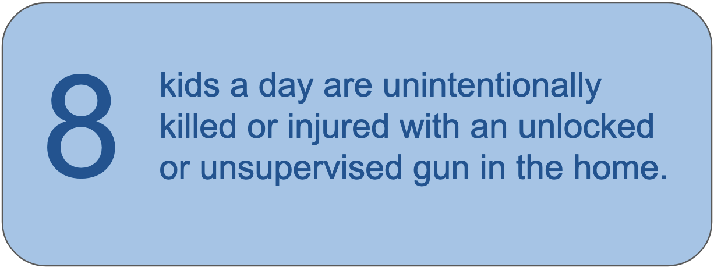
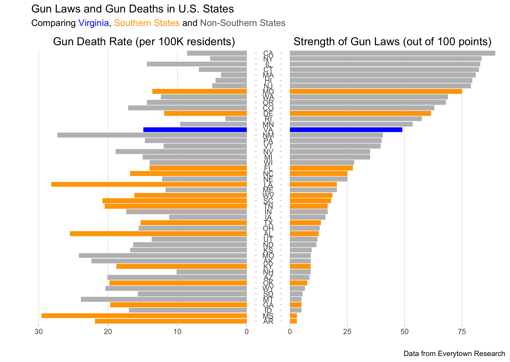

```{r setup, include=FALSE}
knitr::opts_chunk$set(echo = FALSE)
```

Unintentional shootings are a major public safety concern resulting in roughly 520 fatalities[^1] and at least 27,000 injuries[^2] annually. While fatalities due to unintentional shootings are comparatively low – accidental shootings comprised about 1.3% of all gun deaths in 2021 – they account for 37% of all non-fatal gun injuries.[^3] By any metric, unintentional firearm injuries represent a significant and preventable public safety issue that warrants urgent attention. 

```{r out.width='50%', fig.align='right', out.extra='style="float:right; padding:10px"'}

```

Unintentional shootings, sometimes called accidental shootings,[^4] occur when someone is struck by a bullet that wasn’t fired at them on purpose. Unintentional gun injuries may occur because an individual handling a gun does not realize it is loaded or does not know how to properly hold a gun, discharging it by accident. Or an individual may fire a gun deliberately and without intent to harm but with carelessness of their surroundings. Unintentional shootings can occur when individuals are “playing” with guns or when they’ve been drinking alcohol. Unintentional gun violence affects both children and adults, often in a home environment.

The various circumstances surrounding unintentional discharge makes distinguishing between an intentional and unintentional shooting challenging.[^5] It also highlights the value of approaching gun violence from a public health perspective, rather than from a criminal justice and legal perspective, to place focus on the underlying risk factors to eliminate unintentional gun death and injury by implementing evidence-based prevention strategies. 

### Who's at Risk?

Accidental shootings are distinctively frequent in the US, with “Americans being four times more likely to die from an unintentional shooting than people living in other high-income countries.[^6] However, some populations are disproportionately harmed.

**Men, especially young Black men**: Men of all ages, races, and ethnicities are killed in unintentional shootings at much higher rates than women.[^7] Men under the age of 35 are most likely to experience unintentional gun injury. Among men, Black men aged 20 to 34 are the most likely group to die from unintentional shootings.[^8] 

While women and girls experience far fewer unintentional shootings, among female victims, young Black women and girls – those aged 0 to 19 – are the most likely group to die by this type of violence.[^9] 

**Young people**: Overall, children aged 10-19 are at the highest risk of death by unintentional firearm injury.[^10] While the number of unintentional shootings by children was relatively stable between 2015 and 2023,[^11] rate of unintentional shooting by children aged 0-5 is on the rise.[^12] Children living in homes with easy access to unsecured firearms are at greater risk.[^13] 

```{r out.width='65%', fig.align='right', out.extra='style="float:right; padding:10px"'}

```

**States with weaker gun laws**: More than half of all individuals who die by unintentional gun injuries live in the south. Southerners are three times more likely to die by unintentional gun injuries than their northeastern counterparts.[^14] Researchers point to weaker gun violence prevention laws in the south as a primary reason for this discrepancy.[^15] 

### Factors That Increase Risk

**Easy Access**: Access to and availability of firearms is a primary cause of unintentional shootings, especially for children; the risk is aggravated by unmonitored access to firearms in the home. The access that children, or young adults, have to a gun at home directly impacts the chances that this gun may be mishandled, leading to an unintentional shooting.[^16]  

**Unsafe Storage**: An estimated 54 percent of gun owners do not lock all of their guns securely.[^17] Among gun deaths of children, the firearm used was most frequently stored in an unlocked location and loaded.[^18] Carrying a gun outside the home increases the chances that the gun will be left unsecured.[^19] And as the gun industry has made firearms lighter and easier to use, children are more likely to mistake them for toys.[^20] 

**Improper Training**: Nearly one third of unintentional firearm deaths occur because a gun was not being handled properly while about one fifth involved someone believing a loaded gun was unloaded.[^21] Both of these behaviors stem from a lack of knowledge on how to operate a gun safely.[^22] Children, of course, are especially unlikely to have formal training on gun safety.

A review of research on the effects of gun safety training found few consistent effects on people’s behavior with guns, but notes that the effectiveness may depend on the content of training, motivation of participants, and the credibility of the trainer to participants.[^23] Nevertheless, some states have begun experimenting with requiring firearm safety training for gun purchasers.[^24]

**Additional contributing factors**: Alcohol is another risk factor. Among people aged 20-29 who were victims of an accidental shooting, 46.8% of cases involved alcohol.[^25] Older adults suffering from dementia or related conditions may also be at higher risk of an accidental shooting, especially given the high rate of gun ownership among adults aged 65 and older.[^26] 

### Consequences

While unintentional shootings most commonly lead to injury rather than death, victims of accidental shootings may endure the same severe, life-altering injuries, including disabilities and chronic pain, as victims of other gun-related incidents. The physical and mental health toll can impact education, employment, and substance use.[^27] Medical incidents and costs can extend beyond the initial shooting if individuals are readmitted to a hospital, as occurs for  approximately 10% of firearm survivors.[^28] Individuals and families bear the financial and emotional burden of medical care and rehabilitation, which can drain resources and contribute to financial instability.[^29]

Because most unintentional firearm injury occurs under conditions of low threat – when individuals are handling guns for routine activities and without intent to harm – unintentional shootings are often understood as private tragedies. The impact on those impacted, though, can be severe; these are not inevitable consequences of gun ownerships. Prevention measures are available.

### The Local Context

**What do we know about unintentional shootings in the Charlottesville City and Albemarle County region?**

The data around unintentional firearm injuries and deaths are especially incomplete. Injury data is believed to contain error due to underreporting, if victims don't present at an Emergency Room, and overreported, if victims report an intentional shooting as accidental. Fatality data, too, suffer from misclassification, with both true accidents recorded as homicides or suicides and intentional gun fatalities reported as accidents.[^30] The limitations of the data structure around gun injury and harm make it challenging to evaluate unintentional shootings at the local level.

While data from the Gun Violence Archive reports only four accidental shootings in the region between 2021 and 2023, this is limited to incidents either recorded by law enforcement or reported by media sources.[^31] If national patterns hold, unintentional shootings could account for 30% or more of the 300-plus firearem injuries the Virginia Department of Health reports for our region in the last six years.[^32] Among the four local reports of unintentional shooting in the Gun Violence Archive, all involved  adults and one resulted in a death.

Virginia has long made it unlawful for a gun owner "to recklessly leave a loaded, unsecured firearm" within ready access of a child under the age of 14,[^33] but has no law that requires unattended firearms to be stored in a certain way. There is also no state law requiring firearm training for gun purchases. These, though, are only a few of the strategies proposed to reduce the occurrence of unintentional gun injury and death.

### About This Work 

<div class="shadowbox">
**Fall 2024 Gun Violence Clinic**: Michele Claibourn (Batten Faculty, Equity Center), Kate Hegel, Anastasia Jones-Burdick, Josh LeMay, Owen McCoy, Elizabeth Miles, Frances Summers, Samantha Toet (Equity Center)
</div>

This issue brief is the work of the Fall 2024 Gun Violence Clinic, sponsored by The Batten School of Leadership and Public Policy as part of UVA’s [Gun Violence Solutions Project](https://provost.virginia.edu/subsite/gun-violence-solutions-project/about-gvsp). We are developing a series of issue briefs  intended to identify and distinguish the multiple problems of gun violence to contribute to the community’s work in connecting a range of strategies to the most relevant problems. Recent work has highlighted how distortions in how gun violence is [framed](https://firearmslaw.duke.edu/2020/01/warped-narratives-distortion-in-the-framing-of-gun-policy) or [understood](https://scholarship.richmond.edu/cgi/viewcontent.cgi?article=1549&context=pilr) has limited the policy conversation.

The Gun Violence Clinic is working to support [The Equity Center’s](https://www.virginiaequitycenter.org/) local [data efforts](https://github.com/virginiaequitycenter/cville-alb-gun-trauma) and the [Community Safety Implementation Group’s](https://prescouncil.president.virginia.edu/community-safety) collective work by creating resources for shared community understanding and decision making. As this work progresses, we hope to amplify and share the knowledge of the community. If you believe there is more we should add to this brief or would like to talk to us further, please reach out to Michele Claibourn at mclaibourn\@virginia.edu.  

Future iterations of the Clinic will dive into the research on recommended solutions to unintentional gun violence and how these might be adapted to our context; develop additional issue briefs around other distinct types of gun violence; map the resources, organizations, and programs to reduce gun violence already present within the community; and work with community partners to further expand awareness of the problems of gun violence locally along with solutions. Our work will always be openly shared.


[^1]: [The Public Health Approach to Prevent Gun Violence.](https://publichealth.jhu.edu/center-for-gun-violence-solutions/research-reports/the-public-health-approach-to-prevent-gun-violence) Johns Hopkins University, Bloomberg School of Public Health.

[^2]: Faiz Gani, Joseph V. Sakran, and Joseph K. Canner. 2017. “Emergency Department Visits For Firearm-Related Injuries In The United States, 2006–14.” Health Affairs 36(10): https://doi.org/10.1377/hlthaff.2017.0625

[^3]: “[Unintentional Shootings](https://efsgv.org/learn/type-of-gun-violence/unintentional-shootings/).” The Educational Fund to Stop Gun Violence. 

[^4]: While accidental and unintentional are sometimes used interchangeably, the language of accident may obscure that the harm is preventable. “[Unintentional Shootings](https://efsgv.org/learn/type-of-gun-violence/unintentional-shootings/).” The Educational Fund to Stop Gun Violence. 

[^5]: “[Unintentional Shootings](https://efsgv.org/learn/type-of-gun-violence/unintentional-shootings/).” The Educational Fund to Stop Gun Violence. 

[^6]: Solnick, S.J., Hemenway, D. Unintentional firearm deaths in the United States 2005–2015. Inj. Epidemiol. 6, 42 (2019). https://doi.org/10.1186/s40621-019-0220-0 

[^7]: “[Unintentional Shootings](https://efsgv.org/learn/type-of-gun-violence/unintentional-shootings/).” The Educational Fund to Stop Gun Violence. 

[^8]: “[Unintentional Shootings](https://efsgv.org/learn/type-of-gun-violence/unintentional-shootings/).” The Educational Fund to Stop Gun Violence. 

[^9]: “[Unintentional Shootings](https://efsgv.org/learn/type-of-gun-violence/unintentional-shootings/).” The Educational Fund to Stop Gun Violence.

[^10]: Solnick, S.J., Hemenway, D. Unintentional firearm deaths in the United States 2005–2015. Inj. Epidemiol. 6, 42 (2019). https://doi.org/10.1186/s40621-019-0220-0  

[^11]: [#NotAnAccident Index.](https://everytownresearch.org/maps/notanaccident/) Everytown Research and Policy.

[^12]: Cannon AD, Reese K, Tetens P, Fingar KR. Preventable tragedies: findings from the #NotAnAccident index of unintentional shootings by children. Inj Epidemiol. 2023 Oct 23;10(Suppl 1):52. https://doi.org/10.1186/s40621-023-00464-3

[^13]: "[Analysis: Unintentional Shootings Increase around Major U.S. Holidays.](https://www.bradyunited.org/resources/research/unintentional-shootings-increase-holidays)” Brady United.

[^14]: “[Unintentional Shootings](https://efsgv.org/learn/type-of-gun-violence/unintentional-shootings/).” The Educational Fund to Stop Gun Violence.

[^15]: Simonetti JA, Rowhani-Rahbar A, Mills B, Young B, Rivara FP. State Firearm Legislation and Nonfatal Firearm Injuries. Am J Public Health. 2015 Aug;105(8):1703-9. https://doi.org/10.2105/AJPH.2015.302617

[^16]: “[Children and Guns/Firearms.](https://www.aacap.org/AACAP/Families_and_Youth/Facts_for_Families/FFF-Guide/Children-And-Guns-Firearms-037.aspx)” American Academy of Child & Adolescent Psychiatry.

[^17]: Murrow, S. “[More than half of U.S. gun owners do not safely store their guns, survey finds.](https://hub.jhu.edu/2018/02/22/more-than-half-gun-owners-do-not-safely-store-their-guns/)” John Hopkins University. (2018). 

[^18]: Wilson RF, Mintz S, Blair JM, Betz CJ, Collier A, Fowler KA. Unintentional Firearm Injury Deaths Among Children and Adolescents Aged 0–17 Years — National Violent Death Reporting System, United States, 2003–2021. MMWR Morb Mortal Wkly Rep 2023;72:1338–1345. DOI: http://dx.doi.org/10.15585/mmwr.mm7250a1 

[^19]: Jennifer Mascia. 2022. “[How Often are Guns Involved in Accidental Deaths?](https://www.thetrace.org/2022/12/accidental-shootings-cdc-data-children/)” The Trace. 

[^20]: Jennifer Mascia. 2022. “[How Often are Guns Involved in Accidental Deaths?](https://www.thetrace.org/2022/12/accidental-shootings-cdc-data-children/)” The Trace. 

[^21]: Solnick, S.J., Hemenway, D. Unintentional firearm deaths in the United States 2005–2015. Inj. Epidemiol. 6, 42 (2019). https://doi.org/10.1186/s40621-019-0220-0

[^22]: isinger WB, Nickols AK, Harris AN, et al Applying the antecedent, behaviour, and consequence taxonomy to unintentional firearm injury as determined by a collaborative firearm injury database. Injury Prevention 2024;30:39-45.

[^23]: “[The Effects of Firearm Safety Training Requirements.](https://www.rand.org/research/gun-policy/analysis/firearm-safety-training-requirements.html)” 2020/2024. RAND. 

[^24]: As of 2024, California, Connecticut, Hawaii, Maryland, Massachusetts, New Mexico, Rhode Island, Washington, and the District of Columbia required some form of training. “[The Effects of Firearm Safety Training Requirements.](https://www.rand.org/research/gun-policy/analysis/firearm-safety-training-requirements.html)” 2020/2024. RAND.

[^25]: Solnick, S.J., Hemenway, D. Unintentional firearm deaths in the United States 2005–2015. Inj. Epidemiol. 6, 42 (2019). https://doi.org/10.1186/s40621-019-0220-0 

[^26]: Betz ME, McCourt AD, Vernick JS, Ranney ML, Maust DT, Wintemute GJ. Firearms and Dementia: Clinical Considerations. Ann Intern Med. 2018 Jul 3;169(1):47-49. https://doi.org/10.7326/M18-0140. 

[^27]: Vella MA, Warshauer A, Tortorello G, Fernandez-Moure J, Giacolone J, Chen B, Cabulong A, Chreiman K, Sims C, Schwab CW, Reilly PM. Long-term functional, psychological, emotional, and social outcomes in survivors of firearm injuries. JAMA surgery. 2020 Jan 1;155(1):51-9.

[^28]: Derek C Lumbard, Chad J Richardson, Frederick W Endorf, Rachel M Nygaard. 2023. “Firearm injury survival is only the beginning: The impact of socioeconomic factors on unplanned readmission after injury.” Injury 54(8). https://doi.org/10.1016/j.injury.2023.110893 

[^29]: Patrick Boyle. 2022. “[The cost of surviving gun violence: Who pays?](https://www.aamc.org/news/cost-surviving-gun-violence-who-pays)” AAAMCNews.

[^30]: Barber C, Hemenway D. Too many or too few unintentional firearm deaths in official U.S. mortality data? Accid Anal Prev. 2011 May;43(3):724-31. https://doi.org/10.1016/j.aap.2010.10.018

[^31]: Unintentional shootings are less likely to be reported to law enforcement, in general. The decline of local media throughout the county, but especially in small media markets, means the opportunities for broader awareness are limited.

[^32]: See https://www.vdh.virginia.gov/surveillance-and-investigation/syndromic-surveillance/firearm-injury-surveillance/

[^33]: https://law.lis.virginia.gov/vacode/title18.2/chapter4/section18.2-56.2/